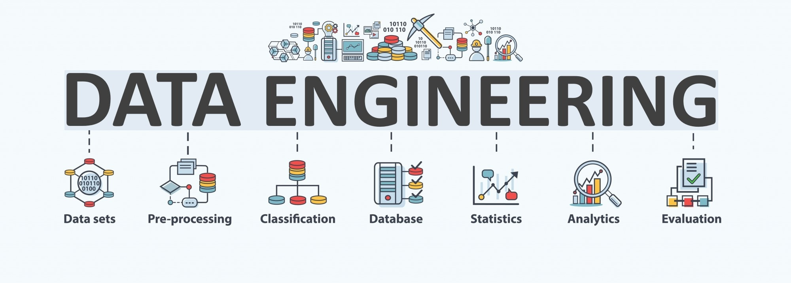

# Road to Data Engineer

Crea la infraestructura de extracción y preparación de datos para analítica en organizaciones, los cursos se componen de tres aspectos clave que son:

- Introducción a programación e ingeniería de datos
- Fuentes de datos y Data Warehousing
- Computación en la nube

| Curso | Estatus | Proyecto |
|-------|--------------|-----------|
| Fundamentos de Ingeniería de Datos | |  |
| Curso Profesional de Git y GitHub |  | |
| Python: PIP y Entornos Virtuales | ||
| Análisis Exploratorio de Datos |  |  |  
| Configuración Profesional de Entorno de Trabajo para Ciencia de Datos |  |  |
| Manejo de Datos Faltantes: Detección y Exploración |  |  |
| Manejo de Datos Faltantes: Imputación || |
| PostgreSQL | |  |  
| Curso Práctico de SQL |  |  |
| PostgreSQL Aplicado a Ciencia de Datos | | |
| Base de Datos NoSQL | | |
| Introducción a AWS: Fundamentos de Cloud Computing |  |  |
| Introducción a AWS: Cómputo, Almacenamiento y Bases de Datos |  |  |
| Introducción a AWS: Redes, Gobernanza y Machine Learning |  | |
| Curso Práctico de AWS: Roles y Seguridad con IAM |  |  |
| Fundamentos de ETL con Python y Pentaho |  |  |
| Data Warehousing y Modelado OLAP |  |  |
| Databricks: Arquitectura Delta Lake |  |  |
| Fundamentos de Apache Airflow |  |  |
| Programación en Bash Shell |  |  |
| Introducción a la Administración de Servidores Linux |  |  |
| Curso Práctico de AWS: Cómputo con EC2 |  |  |
| Curso Práctico de Storage en AWS |  |  |
| Curso Práctico de Bases de Datos en AWS |  |  |
| Curso de Big Data en AWS |  |  |
| Curso de AWS Redshift para Manejo de Big Data |  |  |
| Curso de Docker: Fundamentos |  | |
